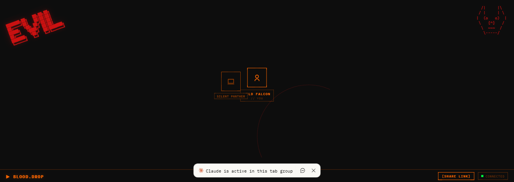

```
███████╗██╗   ██╗██╗██╗
██╔════╝██║   ██║██║██║
█████╗  ╚██╗ ██╔╝██║██║
██╔══╝   ╚████╔╝ ██║██║
███████╗  ╚██╔╝  ██║███████╗
╚══════╝   ╚═╝   ╚═╝╚══════╝

▶ BLOOD.DROP // P2P FILE TRANSFER
```



---

**Drop files between devices on your local network.**
No cloud. No accounts. No middleman. Pure WebRTC.

---

## HOW IT WORKS

```
 DEVICE A                        DEVICE B
 ────────                        ────────
 [browser]  ──── WebSocket ────▶ [signaling server]
            ◀─── ICE offer ─────
            ──── ICE answer ───▶
            ◀═══ WebRTC P2P ════▶ [browser]
                 (direct)
```

Files go **device to device** — the server only brokers the initial handshake.

---

## STACK

| Layer | Tech |
|-------|------|
| Transfer | WebRTC Data Channels (16KB chunks) |
| Signaling | WebSocket (Node.js) |
| File links | Express + Multer |
| Frontend | Vanilla JS / HTML / CSS |
| Font | IBM Plex Mono |

---

## QUICK START

```bash
# 1. Install server deps
cd server && npm install

# 2. Start signaling server
node index.js

# 3. Serve frontend (separate terminal)
cd client && python3 -m http.server 8080
```

Open `http://localhost:8080` on this device.
On other devices (same WiFi): `http://<your-LAN-ip>:8080`

**Windows:** just run `start.bat` — launches everything + opens browser.

---

## USAGE

```
1. Open BLOOD.DROP on two devices (same WiFi)
2. Devices appear on each other's radar automatically
3. Click a device → select a file → send
4. Or use [SHARE LINK] to generate a download URL
```

---

## PROJECT STRUCTURE

```
blood-drop/
├── client/
│   ├── index.html      # UI
│   ├── style.css       # Bloomberg terminal theme
│   └── main.js         # WebRTC + WebSocket logic
├── server/
│   ├── index.js        # Signaling server + file upload
│   └── package.json
└── start.bat           # Windows launcher
```

---

## LICENSE

Apache License 2.0
